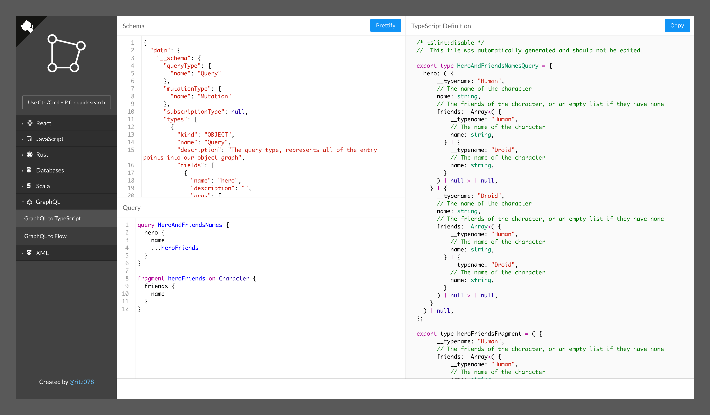

---

## Credits

The logo has been designed by [mikicon](https://thenounproject.com/mikicon/).

## License

MIT @ Ritesh Kumar

## Contributors

Thanks goes to these wonderful people ([emoji key](https://github.com/kentcdodds/all-contributors#emoji-key)):

<!-- ALL-CONTRIBUTORS-LIST:START - Do not remove or modify this section -->
<!-- prettier-ignore-start -->
<!-- markdownlint-disable -->
<table>
  <tr>
    <td align="center"><a href="http://riteshkr.com"> <b>Ritesh Kumar</b></a> <a href="https://github.com/ritz078/transform/commits?author=ritz078" title="Documentation">📖</a> <a href="https://github.com/ritz078/transform/commits?author=ritz078" title="Code">💻</a> <a href="#ideas-ritz078" title="Ideas, Planning, & Feedback">🤔</a> <a href="https://github.com/ritz078/transform/pulls?q=is%3Apr+reviewed-by%3Aritz078" title="Reviewed Pull Requests">👀</a></td>
    <td align="center"><a href="http://asquera.de"> <b>Florian Gilcher</b></a> <a href="https://github.com/ritz078/transform/commits?author=skade" title="Code">💻</a></td>
    <td align="center"><a href="http://pascalhertleif.de/"> <b>Pascal Hertleif</b></a> <a href="https://github.com/ritz078/transform/commits?author=killercup" title="Code">💻</a></td>
    <td align="center"><a href="http://landish.github.io"> <b>Lado Lomidze</b></a> <a href="https://github.com/ritz078/transform/commits?author=Landish" title="Code">💻</a></td>
    <td align="center"><a href="https://github.com/mattiamanzati"> <b>Mattia Manzati</b></a> <a href="https://github.com/ritz078/transform/commits?author=mattiamanzati" title="Code">💻</a></td>
    <td align="center"><a href="https://tarino.ir"> <b>Mohammad Rajabifard</b></a> <a href="#ideas-morajabi" title="Ideas, Planning, & Feedback">🤔</a> <a href="https://github.com/ritz078/transform/commits?author=morajabi" title="Code">💻</a></td>
    <td align="center"><a href="http://raathigesh.com/"> <b>Raathigeshan Kugarajan</b></a> <a href="https://github.com/ritz078/transform/commits?author=Raathigesh" title="Code">💻</a></td>
  </tr>
  <tr>
    <td align="center"><a href="https://gyandeeps.com"> <b>Gyandeep Singh</b></a> <a href="https://github.com/ritz078/transform/commits?author=gyandeeps" title="Code">💻</a></td>
    <td align="center"><a href="https://matt.life"> <b>Matt Holt</b></a> <a href="https://github.com/ritz078/transform/commits?author=mholt" title="Code">💻</a></td>
    <td align="center"><a href="https://medium.com/@sreenivas"> <b>sreenivas alapati</b></a> <a href="https://github.com/ritz078/transform/commits?author=cg-cnu" title="Code">💻</a></td>
    <td align="center"><a href="https://performancejs.com"> <b>Boris Cherny</b></a> <a href="https://github.com/ritz078/transform/commits?author=bcherny" title="Code">💻</a></td>
    <td align="center"><a href="http://www.twitter.com/intabulas"> <b>Mark Lussier</b></a> <a href="https://github.com/ritz078/transform/commits?author=intabulas" title="Code">💻</a></td>
    <td align="center"><a href="https://github.com/brikou"> <b>Brice BERNARD</b></a> <a href="https://github.com/ritz078/transform/commits?author=brikou" title="Code">💻</a></td>
    <td align="center"><a href="https://twitter.com/@satya164"> <b>Satyajit Sahoo</b></a> <a href="https://github.com/ritz078/transform/commits?author=satya164" title="Code">💻</a></td>
  </tr>
  <tr>
    <td align="center"><a href="https://medium.com/@shakyShane"> <b>Shane Osbourne</b></a> <a href="https://github.com/ritz078/transform/commits?author=shakyShane" title="Code">💻</a></td>
    <td align="center"><a href="https://github.com/pd4d10"> <b>Rongjian Zhang</b></a> <a href="https://github.com/ritz078/transform/commits?author=pd4d10" title="Code">💻</a></td>
    <td align="center"><a href="http://keshShan.github.io"> <b>Keshan Nageswaran</b></a> <a href="https://github.com/ritz078/transform/commits?author=KeshShan" title="Code">💻</a></td>
    <td align="center"><a href="http://www.codegent.com"> <b>codegent</b></a> <a href="https://github.com/ritz078/transform/commits?author=code" title="Code">💻</a></td>
    <td align="center"><a href="https://github.com/bastor"> <b>Sebastian Maliszczak</b></a> <a href="https://github.com/ritz078/transform/commits?author=bastor" title="Code">💻</a></td>
    <td align="center"><a href="https://haroen.me"> <b>Haroen Viaene</b></a> <a href="https://github.com/ritz078/transform/commits?author=Haroenv" title="Code">💻</a></td>
    <td align="center"><a href="https://timn.tech"> <b>Tim Neutkens</b></a> <a href="#plugin-timneutkens" title="Plugin/utility libraries">🔌</a> <a href="https://github.com/ritz078/transform/commits?author=timneutkens" title="Code">💻</a></td>
  </tr>
  <tr>
    <td align="center"><a href="https://github.com/raminrez"> <b>Ramin Rezaie</b></a> <a href="https://github.com/ritz078/transform/commits?author=raminrez" title="Code">💻</a></td>
    <td align="center"><a href="https://guilhermeesteves.com"> <b>Guilherme Esteves</b></a> <a href="https://github.com/ritz078/transform/commits?author=guilhermesteves" title="Code">💻</a></td>
    <td align="center"><a href="https://github.com/p-racoon"> <b>Prasham Ashesh</b></a> <a href="https://github.com/ritz078/transform/commits?author=p-racoon" title="Code">💻</a></td>
    <td align="center"><a href="https://ghuser.io/jamesgeorge007"> <b>James George</b></a> <a href="https://github.com/ritz078/transform/commits?author=jamesgeorge007" title="Code">💻</a></td>
    <td align="center"><a href="https://chaitanyagadodia.github.io/"> <b>Chaitanya Gadodia</b></a> <a href="https://github.com/ritz078/transform/commits?author=ChaitanyaGadodia" title="Code">💻</a></td>
    <td align="center"><a href="https://miklos.dev"> <b>Miklos Megyes</b></a> <a href="https://github.com/ritz078/transform/commits?author=miklosme" title="Code">💻</a></td>
    <td align="center"><a href="https://github.com/Rishabh-Rathod"> <b>Rishabh Rathod</b></a> <a href="https://github.com/ritz078/transform/commits?author=Rishabh-Rathod" title="Code">💻</a></td>
  </tr>
</table>

<!-- markdownlint-enable -->
<!-- prettier-ignore-end -->

<!-- ALL-CONTRIBUTORS-LIST:END -->

This project follows the [all-contributors](https://github.com/kentcdodds/all-contributors) specification. Contributions of any kind welcome!
